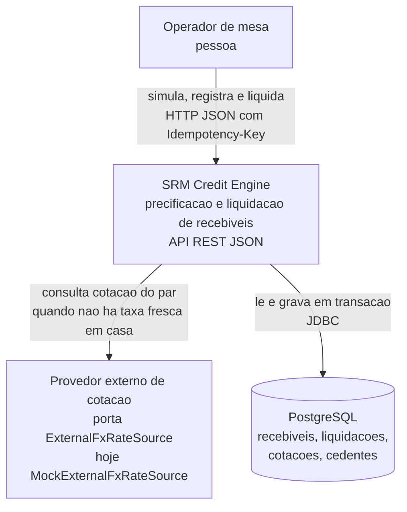
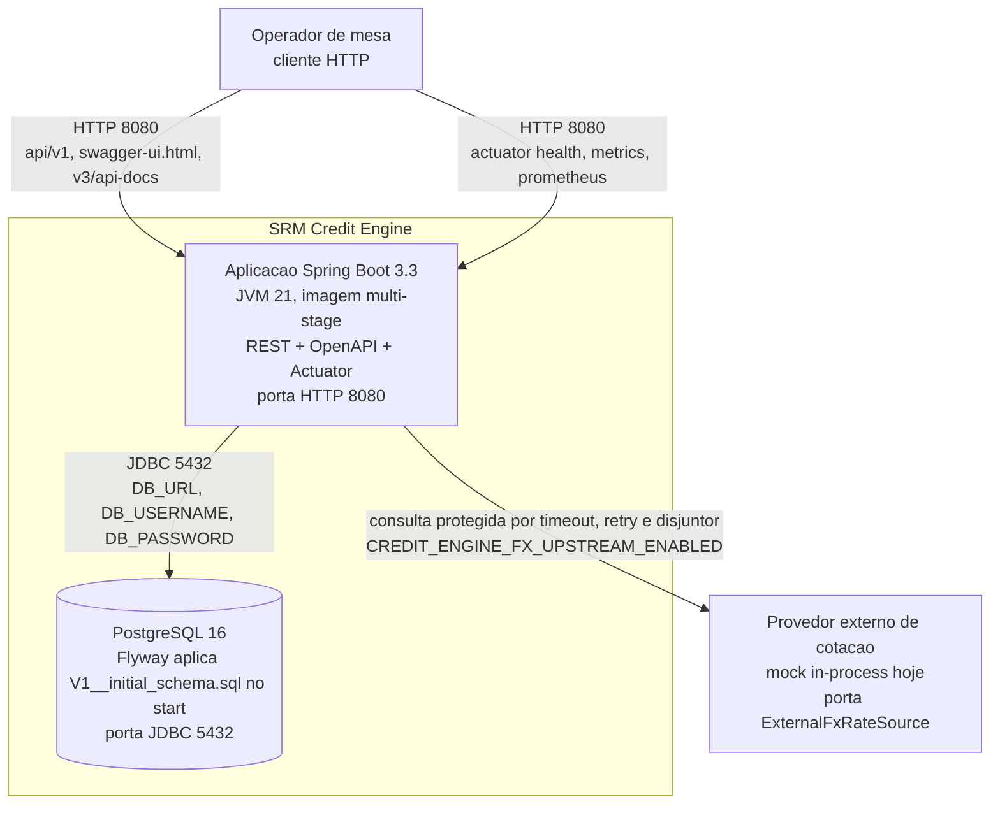
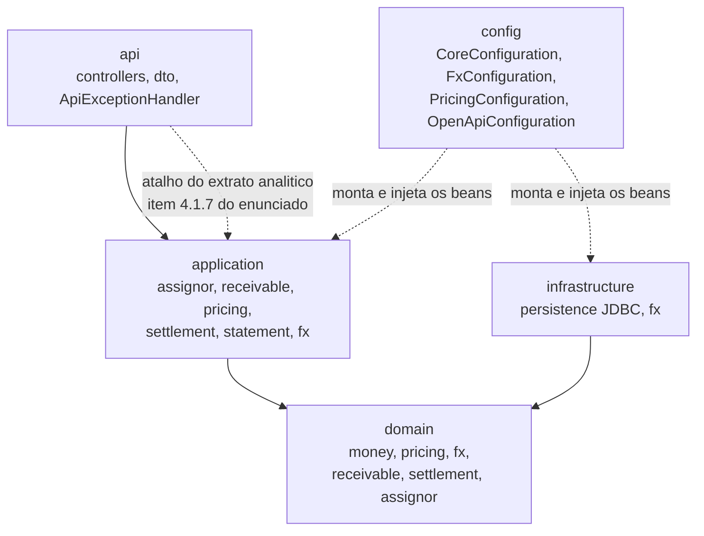
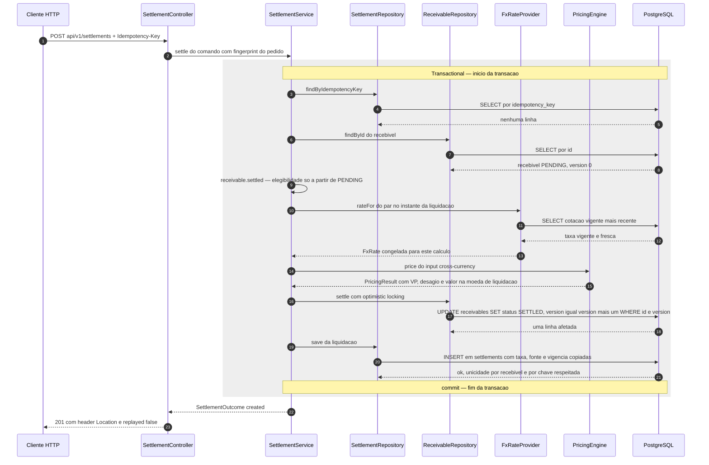
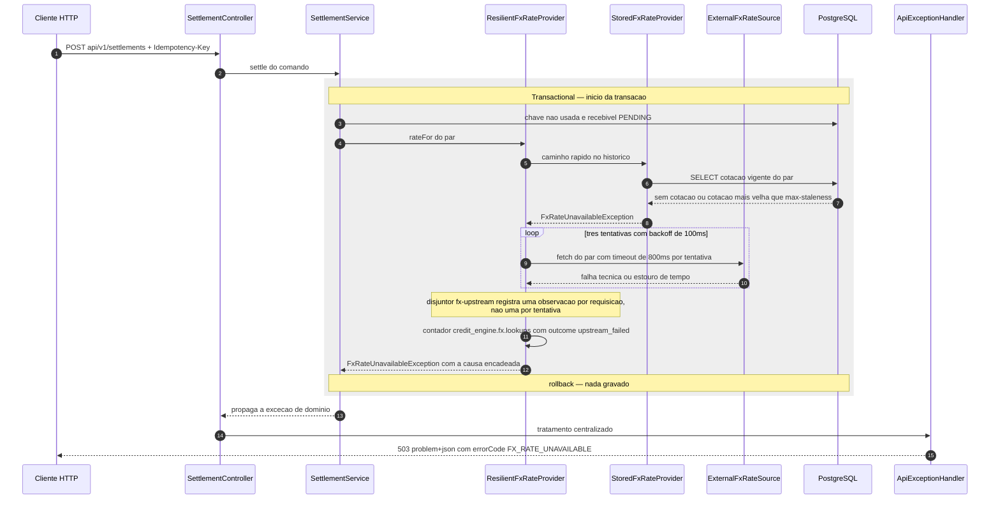

# Arquitetura — SRM Credit Engine

Diagrama C4 nos níveis **1 (contexto)** e **2 (containers)**, mais um recorte de componentes e os dois fluxos que sustentam o caminho de dinheiro. Este documento **complementa** o [`README.md`](README.md) (camadas, stack, resiliência do câmbio, contrato de erros, observabilidade) e o [`SPEC.md`](SPEC.md) (premissas de negócio e precisão) — quando a decisão já está defendida lá, aqui fica só o que o desenho mostra e o porquê da forma.

Todo elemento dos diagramas corresponde a código deste repositório: pacote, classe, tabela, endpoint, métrica ou variável de ambiente. Caixa sem contraparte no código não entrou.

---

### Nível 1 — Contexto de sistema

**Operador de mesa.** Único ator humano. Quer três coisas, nesta ordem: simular o valor presente sem efeito colateral (`POST /api/v1/simulations`), liquidar exatamente uma vez (`POST /api/v1/settlements` com `Idempotency-Key`) e conferir o que foi pago (`GET /api/v1/settlements/statement`). Não há frontend nesta entrega: a interface do operador é a API documentada em Swagger UI. Relação de confiança: o operador é autenticado fora do escopo desta entrega, mas **não é confiável quanto a repetição** — duplo clique e retry de rede são certeza, e é por isso que a chave de idempotência é header obrigatório em vez de campo opcional do corpo.

**SRM Credit Engine.** Dono das duas invariantes que o desafio cobra: o número (valor presente, deságio, conversão ao centavo) e o pagamento único (atômico, idempotente, auditável). Guarda a cotação efetivamente aplicada dentro do registro de liquidação, em vez de referenciá-la, para que o extrato nunca reinterprete "qual taxa seria a vigente".

**Provedor externo de cotação.** Hoje é `MockExternalFxRateSource`, criado condicionalmente em `FxConfiguration` quando `credit-engine.fx.upstream.enabled` é `true`. O mock é **explicitamente um mock** — com latência e instabilidade configuráveis em `application.yml` — e existe para tornar timeout, retry e disjuntor demonstráveis sem depender de rede real. O ponto de troca é a porta **`ExternalFxRateSource`**: substituir por PTAX, mesa ou agregador de mercado é escrever um adapter em `infrastructure/fx` e mudar um `@Bean`; nem o domínio nem `SettlementService` são tocados. Esta é a **única dependência que pode cair sem que a culpa seja nossa**, e por isso é a única cuja falha é traduzida em **503 `FX_RATE_UNAVAILABLE`**: sem taxa confiável, a liquidação cross-currency não assume 1:1, não usa taxa velha e não inventa default — falha e devolve a decisão ao operador.

**PostgreSQL.** Não é "onde os dados ficam": é **coguardião das invariantes**. `uk_settlements_receivable`, `uk_settlements_idempotency_key`, a coluna `version` de `receivables` e o gatilho `trg_settlements_immutable` continuam valendo com duas instâncias da aplicação no ar, ou com alguém rodando SQL na mão. Relação de falha: banco indisponível é **indisponibilidade nossa** — `ApiExceptionHandler` traduz `DataAccessException` em **503 `PERSISTENCE_UNAVAILABLE`** com a orientação de repetir a requisição com a mesma `Idempotency-Key`, que é exatamente o que torna o retry seguro.

O pipeline de CI (`.github/workflows/ci.yml`) **não aparece aqui**: é ferramenta do processo de entrega, não ator que consome ou serve o sistema em execução. Colocá-lo no C1 confundiria "quem usa o sistema" com "como o sistema é construído".

---

### Nível 2 — Containers

No `docker-compose.yml` são dois containers de verdade — `app` e `db` — e o provedor externo é desenhado fora da fronteira de propósito: hoje ele executa **dentro do processo** da aplicação, mas o contrato é o de um terceiro remoto, e desenhá-lo como parte da aplicação esconderia justamente o risco que a resiliência existe para tratar. O serviço `app` só sobe depois do `healthcheck` com `pg_isready` no `db`; sem isso o Flyway falha na primeira tentativa e o container reinicia em loop.

| Container | Responsabilidade | Tecnologia | Escala e falha |
|-----------|------------------|------------|----------------|
| `app` | Contrato HTTP, orquestração dos casos de uso, motor de precificação, fronteira transacional, resiliência do câmbio, métricas de negócio | Java 21, Spring Boot 3.3, Spring JDBC `JdbcClient`, springdoc, Micrometer, resilience4j; Dockerfile multi-stage com usuário sem privilégio e `ExitOnOutOfMemoryError` | **Stateless** — escala horizontal atrás de balanceador, sem sessão nem cache local de estado. Nenhuma garantia depende de haver uma única instância: idempotência e unicidade moram no banco. Instância que cai é substituída; requisição em voo é desfeita pela transação e o cliente repete com a mesma `Idempotency-Key`. Pool Hikari de 10 conexões com `connection-timeout` de 3s, pequeno de propósito para que contenção apareça em vez de se esconder. |
| `db` | Persistência e **invariantes**: unicidade, checks, `version` para optimistic locking, gatilho de imutabilidade, índices do extrato | PostgreSQL 16, `NUMERIC(19,2)` para valores e `NUMERIC(19,6)` para taxas, Flyway | **Escala vertical + réplica de leitura** seria o próximo passo natural — o extrato é o único consumidor pesado de leitura e já está isolado atrás de `SettlementStatementQuery`. Ponto único de falha assumido: banco fora do ar é o sistema fora do ar, com **503 `PERSISTENCE_UNAVAILABLE`** em vez de resposta parcial. Não existe caminho de escrita que contorne o banco. |
| Provedor de cotação | Cotação do par quando não há taxa vigente e fresca no histórico | `ExternalFxRateSource`; hoje `MockExternalFxRateSource`, ligado só no compose via `CREDIT_ENGINE_FX_UPSTREAM_ENABLED=true` | **Não escala por nós** — é de terceiro. Fora do ar: o disjuntor `fx-upstream` abre, a liquidação cross-currency **sem taxa fresca** falha com 503 e o `FxUpstreamHealthIndicator` publica `DEGRADED` — não `DOWN`, porque liquidação em moeda única e cross-currency com taxa fresca continuam funcionando e marcar a aplicação como fora do ar faria o orquestrador derrubar instância saudável. Desligado, `fxRateProvider` é apenas `StoredFxRateProvider` sobre o histórico do banco. |

Detalhes dos parâmetros de resiliência (`call-timeout` 800ms, `max-attempts` 3, janela do disjuntor, pool sem fila) estão no `README.md`, seção *Resiliência do câmbio*.

O que atravessa esses dois containers e não aparece como caixa: o **rastro da requisição**. `CorrelationIdFilter` abre cada requisição com um `correlationId` (aceito do chamador via `X-Correlation-Id` ou gerado) e a `Idempotency-Key` no MDC, e o `logback-spring.xml` os emite como campo do JSON em `stdout`. É o que permite, num incidente, reconstituir uma tentativa de pagamento inteira — a pergunta que o Anexo B faz — sem cruzar log por horário.

---

### Recorte de componentes da aplicação

Quatro anéis de dependência, com a seta sempre apontando para dentro — `api` → `application` → `domain` ← `infrastructure`:

**(a) O domínio não tem anotação de framework.** `domain` é Java puro: `Money` sobre `BigDecimal`, `RoundingPolicy`, `PricingEngine` com as strategies, `Receivable`, `Settlement`, `FxRate` e as exceções de domínio. Nada de `@Service`, `@Component`, `@Entity` ou `@Transactional` ali dentro. A ligação com o Spring vive em **`config`**: `CoreConfiguration` publica o `Clock` (injetado em vez de `Instant.now()` espalhado, para que o timestamp seja auditável e o teste possa fixar o tempo), `PricingConfiguration` monta o motor a partir de `credit-engine.pricing.*` e `FxConfiguration` compõe a cadeia de câmbio. Consequência prática na defesa: `PricingEngineTest`, `TermCalculatorTest`, `MoneyTest` e `ResilientFxRateProviderTest` rodam **sem contexto Spring e sem banco**.

**(b) Portas declaradas do lado de dentro, implementadas do lado de fora.** Nomes conforme o código:

| Porta | Onde é declarada | Implementação |
|-------|------------------|---------------|
| `ReceivableRepository` | `domain.receivable` | `JdbcReceivableRepository` |
| `SettlementRepository` | `domain.settlement` | `JdbcSettlementRepository` |
| `AssignorRepository` | `domain.assignor` | `JdbcAssignorRepository` |
| `FxRateRepository` | `domain.fx` | `JdbcFxRateRepository` |
| `FxRateProvider` | `domain.fx` | `StoredFxRateProvider` e `ResilientFxRateProvider` |
| `BaseRateProvider` | `domain.pricing` | `FixedBaseRateProvider` |
| `ExternalFxRateSource` | `infrastructure.fx` | `MockExternalFxRateSource` |
| `FxRateWriter` | `infrastructure.fx` | `TransactionalFxRateWriter` |
| `SettlementStatementQuery` | `application.statement` | `JdbcSettlementStatementQuery` |

Duas assimetrias são deliberadas. `ExternalFxRateSource` e `FxRateWriter` vivem em `infrastructure.fx`, não no domínio: o domínio conhece **`FxRateProvider`** — "de onde vem a taxa" com contrato de ou devolver cotação válida ou falhar — e não precisa saber que existe um terceiro na rede nem que a gravação da cotação trazida acontece em transação própria (`REQUIRES_NEW`, para sobreviver ao rollback da liquidação). `SettlementStatementQuery` fica em `application.statement` porque o extrato não carrega agregado de domínio nem participa de transação de negócio.

**(c) O atalho consciente do extrato analítico.** `SettlementStatementController` chama diretamente a porta de leitura `SettlementStatementQuery`, cuja implementação é SQL nativo com paginação e totais calculados no banco, apoiada nos índices `ix_settlements_settled_at`, `ix_settlements_assignor_settled_at` e `ix_settlements_currency_settled_at`. Não há service de aplicação no meio: ele só repassaria a chamada. O item **4.1.7** do enunciado autoriza SQL nativo para o extrato; camada vazia é acoplamento sem benefício, e o critério para ela deixar de ser vazia é claro — no dia em que o extrato ganhar regra própria, como redação de valores por perfil de acesso, o service passa a existir porque terá o que fazer.

---

### Fluxo 1 — Liquidação cross-currency bem-sucedida

Três pontos que a defesa costuma cobrar. **A ordem das etapas é deliberada**: idempotência primeiro, antes de precificar, porque retry não deve custar recálculo nem correr o risco de pagar de novo; a cotação é resolvida **uma vez** e é a mesma que vai para a auditoria. **O `UPDATE` e o `INSERT` estão na mesma transação** — ou o recebível é marcado e a liquidação é gravada, ou nada acontece; o Anexo A fazia os dois fora de transação, com `catch` vazio, e deixava estado inconsistente de propósito. **Métrica**: cada desfecho incrementa `credit_engine.settlements` com `result` em `created`, `replayed`, `idempotency_conflict` ou `concurrent_conflict`, e o motor é cronometrado em `credit_engine.pricing.duration`. Replay da mesma chave com o mesmo corpo sai por `SettlementOutcome.replayed` e devolve **200** com a liquidação original; chave reusada com corpo diferente vira **409 `IDEMPOTENCY_KEY_CONFLICT`**.

---

### Fluxo 2 — Provedor de cotação fora do ar durante a liquidação

**O que sobra no banco depois disso: nada.** `SettlementServiceIntegrationTest.rollsBackWhenFxIsUnavailable` verifica, em PostgreSQL real, que nenhuma linha entrou em `settlements` e que o recebível continua `PENDING` com `version` **0** — a busca da cotação acontece dentro da transação da liquidação, então a exceção desfaz tudo. O cliente pode repetir com a **mesma** `Idempotency-Key` sem risco: não houve liquidação para replicar nem versão consumida.

**Por que 503 e não 200 com taxa antiga.** `FxRateUnavailableException.errorCode()` devolve `FX_RATE_UNAVAILABLE`, e `ApiExceptionHandler.statusFor` mapeia essa exceção para `SERVICE_UNAVAILABLE` — o corpo sai como `application/problem+json` com `errorCode` estável. 503 comunica "dependência fora do ar, vale tentar de novo"; devolver taxa defasada comunicaria "está tudo bem" e transferiria prejuízo silencioso para o fundo ou para o cedente.

**Variações do mesmo caminho**, todas separadas por tag da métrica `credit_engine.fx.lookups`: disjuntor já aberto falha rápido sem tocar no terceiro (`circuit_open`); pool dedicado saturado recusa em vez de enfileirar (`rejected`, ignorado pelo disjuntor e pelo retry, porque capacidade nossa não é falha do terceiro); terceiro que responde `Optional.empty()` — "não coto esse par" — não gera retry nem conta para o disjuntor (`pair_unknown`) e propaga o erro original. `ResilientFxRateProviderTest` cobre cada uma sem Spring e sem banco, incluindo o caso que mais importa para disponibilidade: **disjuntor aberto não bloqueia a liquidação quando há taxa fresca em casa**.

---

### Decisões visíveis no diagrama

- **Monólito modular, não serviços.** Um único container de aplicação com fronteiras internas explícitas (`api`, `application`, `domain`, `infrastructure`). Para este tamanho de problema — um caso de uso crítico, um banco, um terceiro — dividir custaria coordenação distribuída sem nenhum ganho de escala ou de isolamento de falha. Critério de quando valeria dividir: quando o extrato analítico passar a competir por recursos com a liquidação, ou quando um domínio novo tiver ciclo de release e time próprios. O corte estaria pronto e é visível no C2: extrair leitura por trás de `SettlementStatementQuery` é mudar um adapter.
- **Uma transação no banco, não coordenação distribuída.** Marcar o recebível e gravar a liquidação estão na mesma `@Transactional`. Saga, outbox ou two-phase commit resolveriam um problema que este desenho simplesmente não tem: as duas escritas moram no mesmo PostgreSQL. A complexidade distribuída entraria no dia em que o pagamento efetivo virasse chamada a um sistema externo de tesouraria — aí o `INSERT` deixa de ser o fim da história.
- **Banco como coguardião das invariantes, não só a aplicação.** `uk_settlements_receivable` garante pagamento único por recebível, `uk_settlements_idempotency_key` garante chave única, `version` sustenta o optimistic locking (`UPDATE ... WHERE id = ? AND version = ?`) e `trg_settlements_immutable` barra `UPDATE` e `DELETE` em `settlements`. Validação em memória não sobrevive a duas instâncias no ar; `settlementRecordIsImmutableInTheDatabase` e o teste de **8 threads com exatamente 1 pagamento** provam as duas garantias onde elas realmente valem.
- **Terceiro atrás de porta para poder ser trocado sem tocar no domínio.** `ExternalFxRateSource` separa "quem cota" de "como a liquidação usa a cotação". O domínio vê `FxRateProvider` e um contrato binário: cotação válida ou exceção. Trocar mock por provedor real, ou empilhar dois provedores com prioridade, é adapter novo mais uma linha em `FxConfiguration`.
- **Resiliência composta programaticamente, não anotada.** Timeout por dentro, retry no meio, disjuntor por fora, escrito à mão em `FxConfiguration` com os módulos do resilience4j, sem starter e sem AOP. A ordem dos guarda-corpos é a diferença entre uma requisição ruim contar como **uma** observação no disjuntor ou como três — com anotação essa ordem fica implícita na precedência dos aspectos, e "por que o disjuntor abriu numa única requisição" viraria arqueologia.
- **Ausência deliberada de cache de cotação.** Não existe camada de cache no diagrama, e o histórico em `fx_rates` só serve como caminho rápido enquanto a taxa está dentro de `credit-engine.fx.max-staleness` (default 12h). Taxa velha em dia de volatilidade não é degradação graciosa: é prejuízo silencioso. O sistema prefere recusar a liquidação a acertar por sorte.
- **`DEGRADED` em vez de `DOWN` no health.** `FxUpstreamHealthIndicator` reporta disjuntor aberto como degradação, não como queda. Marcar a aplicação como fora do ar faria o orquestrador reiniciar ou tirar do balanceador uma instância que continua liquidando em moeda única e cross-currency com taxa fresca — transformando problema de terceiro em indisponibilidade própria.

---

### Limites do diagrama

- **Não há nível 4 (código).** Classe por classe, com assinatura e dependência, é o que o código já mostra — e com a vantagem de nunca estar desatualizado. Diagrama de código envelhece no primeiro refactor e passa a mentir; o recorte de componentes acima vai até onde o desenho ainda explica decisão, e daí em diante a fonte é `src/main/java`.
- **Não há frontend.** Escopo backend por decisão consciente, registrada no `README.md` e no `SPEC.md`: o enunciado prevê painel e grid, e a prioridade aqui foi o caminho de dinheiro (motor ao centavo, ACID, concorrência, contrato HTTP, evidência de teste). Desenhar um container de UI que não existe seria enfeitar o diagrama com trabalho não entregue.
- **Não há topologia de produção.** Nada de multi-região, réplicas, balanceador, service mesh, gateway ou observabilidade centralizada. O que existe de verdade é o `docker-compose.yml` com dois serviços, e é isso que o C2 mostra. As propriedades que **permitem** escalar estão afirmadas onde são verificáveis — aplicação stateless, invariantes no banco, health separando degradação de queda — mas desenhar a topologia seria especulação sobre requisitos de carga, SLA e custo que ninguém mediu.
- **Não há fronteira de segurança.** Autenticação, autorização e trilha por usuário estão fora desta entrega; o `management.endpoint.health.show-details` já está em `when-authorized`, mas não existe provedor de identidade a desenhar. Caixa de "Auth" sem implementação por trás seria a pior espécie de diagrama: a que promete.
- **Não há fluxo de simulação nem de extrato em sequência.** Os dois estão documentados no `README.md` com `curl` executável e cobertos por `CreditEngineApiIntegrationTest` e `SettlementStatementQueryIntegrationTest`. Os dois diagramas de sequência daqui são os que envolvem transação, concorrência e falha de terceiro — onde a forma do desenho realmente muda o entendimento.
